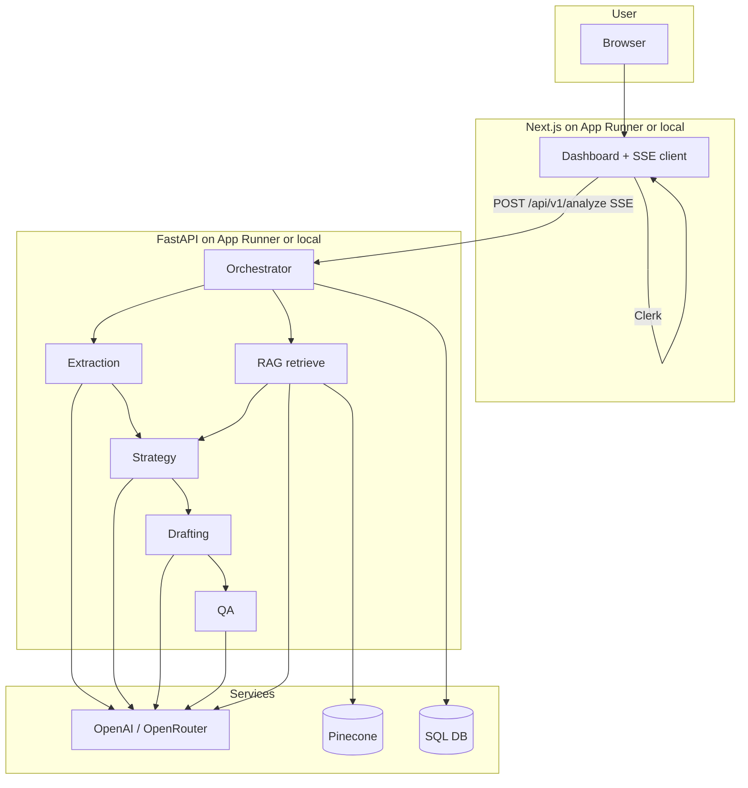

# Litigation Prep Assistant

[](https://www.python.org/)
[](https://fastapi.tiangolo.com/)
[](https://nextjs.org/)
[](https://clerk.com/)
[](https://www.pinecone.io/)
[](https://openrouter.ai)
[](./LICENSE)
[](https://github.com/mrithwik/legal-assitant/actions/workflows/backend-deploy.yml)
[](https://github.com/mrithwik/legal-assitant/actions/workflows/frontend-deploy.yml)

> **AI-assisted litigation preparation** for Kenyan law: turn case text (or a PDF) into a structured legal brief, streamed step-by-step to the browser over **Server-Sent Events (SSE)**.

**Litigation Prep Assistant** is a production-style monorepo: a **FastAPI** backend with a **multi-step LLM pipeline** (extraction, RAG-grounded strategy, drafting, quality review), a **Next.js 16** App Router frontend, **Clerk** authentication, and **Pinecone** for statute retrieval. The corpus lives under `data/raw/`; embeddings use OpenAI `text-embedding-3-small`.

> **Disclaimer:** This system is a **research and productivity aid**, not legal advice. Always have qualified counsel review outputs.

**Provenance:** This repository continues the [Andela AI Engineering Bootcamp team project **litigation-prep-assistant**](https://github.com/Andela-AI-Engineering-Bootcamp/litigation-prep-assistant). The work here **further enhances** that codebase and documentation as part of the **Andela AI Engineering Bootcamp** program requirements (for example production-oriented guides, RAG and infrastructure updates, and follow-on implementation work).

For detailed documentation, see the **[docs/](./docs/README.md)** folder.

---

## At a glance

| Layer | Technology |
|--------|------------|
| UI | Next.js 16, React, Tailwind, shadcn-style components |
| API | FastAPI, async SQLAlchemy, Uvicorn |
| Auth | Clerk (Bearer JWT, JWKS validation on the API) |
| LLM | OpenAI or OpenRouter (`gpt-4o` default) via `instructor` + Pydantic |
| RAG | Pinecone (serverless, cosine, 1536d) + retrieval pipeline in `backend/src/rag/` |
| DB | SQLite in dev/CI, PostgreSQL (Aurora in prod) |
| CI | GitHub Actions: ruff, mypy, pytest (≥70% cov), Next lint/test/build, ECR deploy on `main` |

---

## Architecture

The backend runs **five** user-visible pipeline stages. **Extraction** and **Pinecone retrieval** are scheduled together; the UI receives the fact section as soon as extraction finishes, even if RAG is still in flight. **Strategy** consumes extraction plus retrieved chunks, then **drafting** and **QA** run in sequence. RAG and QA can fail *non-fatally* (empty chunks or missing QA) while the rest of the run continues where designed.



- **End-to-end flow:** [docs/ARCHITECTURE.md](./docs/ARCHITECTURE.md)
- **RAG design:** [docs/RAG.md](./docs/RAG.md)
- **Deployment (AWS, Terraform, CI):** [docs/DEPLOYMENT.md](./docs/DEPLOYMENT.md)

---

## Repository layout (abbreviated)

```
.
├── .github/workflows/     # backend / frontend CI + ECR, evals
├── backend/               # FastAPI, agents, RAG, tests, Dockerfile
├── frontend/              # Next.js app, Dockerfile, Vitest
├── data/raw/              # Kenyan statute text sources for ingestion
├── infra/                 # docker-compose for local Postgres, init SQL
├── terraform/             # backend, frontend, database (AWS)
└── docs/                  # Architecture, API, RAG, ops, security, contributing
```

---

## Quick start

### 1. Environment files

```bash
cp backend/.env.example backend/.env
cp frontend/.env.example frontend/.env.local
```

Minimum backend values: one of **`OPENAI_API_KEY`** or **`OPENROUTER_API_KEY`**, **Pinecone** settings for RAG, **`CLERK_JWKS_URL`**, and (recommended) CORS `ALLOWED_ORIGINS`.  
Frontend: **`NEXT_PUBLIC_CLERK_PUBLISHABLE_KEY`**, **`CLERK_SECRET_KEY`**, **`NEXT_PUBLIC_API_URL`**.

### 2. API

```bash
cd backend
uv sync
uv run uvicorn src.main:app --reload --host 127.0.0.1 --port 8000
```

Open **http://127.0.0.1:8000/docs** for the interactive OpenAPI UI.

### 3. Web app

```bash
cd frontend
npm install
npm run dev
```

### 4. (Optional) Local Postgres

```bash
cd infra && docker compose up -d
```

Set `DATABASE_URL` in `backend/.env` to your Postgres DSN, or keep the default **SQLite** file for simple dev.

### 5. Build the vector index (first RAG use)

With Pinecone configured and `data/raw/` populated:

```bash
cd backend
uv run python -m src.rag.ingestion
```

**Full** setup, test commands, and troubleshooting: [docs/DEVELOPMENT.md](./docs/DEVELOPMENT.md).

---

## API summary

| Method | Path | Auth | Description |
|--------|------|------|-------------|
| `GET` | `/health` | No | Liveness |
| `GET` | `/api/v1/me` | Yes | Current user |
| `POST` | `/api/v1/analyze` | Yes | Multipart case → **SSE** stream |
| `GET` | `/api/v1/cases` | Yes | History (`?q=` filter) |
| `GET` | `/api/v1/cases/{id}` | Yes | Case + steps |
| `DELETE` | `/api/v1/cases/{id}` | Yes | Delete case |

**SSE** events: `markdown_section` (for `extraction`, `rag_retrieval`, `strategy`, `drafting`, `qa`), then `complete` with `case_id`, or `error`. Details: [docs/API.md](./docs/API.md).

---

## Testing and evaluations

**Backend (mocked, no real API cost in the default suite; current count on `main` is 242 tests):**

```bash
cd backend
uv run pytest tests/ -q
uv run pytest tests/ --cov=src --cov-fail-under=70
```

**Frontend:**

```bash
cd frontend
npm run test:run
```

**Eval scripts** (openAI calls, may incur cost): `uv run python -m evals.eval_extraction` and `evals.eval_llm_judge` — see [docs/DEVELOPMENT.md](./docs/DEVELOPMENT.md) and [`.github/workflows/evals.yml`](.github/workflows/evals.yml).

---

## Observability

Structured **structlog** output (JSON in production), request timing, and optional **Langfuse** for LLM traces. Operational notes: [docs/OPERATIONS.md](./docs/OPERATIONS.md).

---

## Cost awareness

Pipeline cost is dominated by **LLM** usage (`gpt-4o` by default) plus **embeddings** and optional **Pinecone** queries. Rough per-run estimates depend on input length; treat published pricing as a guide and monitor usage in your provider console. The LLM-judge eval is the most expensive automated check — run on demand, not on every commit.

---

## Security

JWT validation, dev-only fallbacks, secrets handling, and CORS: [docs/SECURITY.md](./docs/SECURITY.md).

---

## Project team (capstone / attribution)

| Name   | Focus |
|--------|--------|
| Rithwik | FastAPI, orchestration, LLM integration |
| John  | Next.js, Clerk, product UI |
| Amit  | RAG, ingestion, data |
| Damola| Prompts, strategy and QA design |
| Sodiq | AWS deployment, data stores, operations |

Update this table if the roster changes.

---

## License

This project is released under the [MIT License](./LICENSE).

---

## Documentation index

- [docs/README.md](./docs/README.md) — full index
- [docs/ARCHITECTURE.md](./docs/ARCHITECTURE.md) — system design
- [docs/API.md](./docs/API.md) — HTTP and SSE
- [docs/RAG.md](./docs/RAG.md) — Pinecone and retrieval
- [docs/DEVELOPMENT.md](./docs/DEVELOPMENT.md) — local dev and evals
- [docs/DEPLOYMENT.md](./docs/DEPLOYMENT.md) — AWS and CI
- [docs/SECURITY.md](./docs/SECURITY.md) — hardening
- [docs/OPERATIONS.md](./docs/OPERATIONS.md) — logging and on-call
- [docs/CONTRIBUTING.md](./docs/CONTRIBUTING.md) — how to contribute

Sub-app readmes: [backend/README.md](./backend/README.md), [frontend/README.md](./frontend/README.md).
