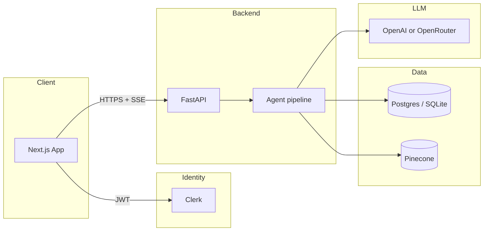

# Architecture

## System context

Litigation Prep Assistant is a **monorepo** with a **Next.js** web app, a **FastAPI** backend, and **managed services** for identity and vector search. A typical request flow:

1. The user signs in with **Clerk** in the browser.
2. The frontend calls the backend with a **Bearer JWT** (and optional PDF/text case input).
3. The backend runs a **multi-step AI pipeline**, persists results in a **relational database**, and streams progress via **Server-Sent Events (SSE)**.
4. The **RAG** layer retrieves Kenyan statute chunks from **Pinecone** (embeddings from OpenAI) to ground the strategy step.

## Agent pipeline (five user-visible steps)

The orchestrator runs **extraction** and **RAG retrieval** in parallel: both only need the raw case text, but the design **streams extraction to the client as soon as it completes** without waiting for Pinecone latency. After that, **strategy**, **drafting**, and **QA** run in order. If RAG fails, the pipeline **continues with empty chunks** (strategy degrades gracefully). If **QA** fails, the brief is still returned and QA is omitted (non-critical step).

| Step | `section_id` (SSE) | Role |
|------|-------------------|------|
| Fact extraction | `extraction` | Structured facts, entities, timeline from `instructor` + Pydantic |
| Precedent retrieval | `rag_retrieval` | Chunks from Pinecone after query expansion, filtering, and reranking |
| Legal strategy | `strategy` | Issues and arguments using extraction + RAG context |
| Draft brief | `drafting` | Kenyan High Court style Markdown brief |
| Quality review | `qa` | Risk and consistency check (optional if this step errors) |

Implementation: `backend/src/agents/orchestrator.py`, agents under `backend/src/agents/`, prompts under `backend/src/agents/prompts/`.

## Data stores

- **Relational (SQLAlchemy async):** users (linked to Clerk subject), cases, and per-step JSON results. SQLite for local/CI; PostgreSQL (e.g. Aurora) in production. Models: `backend/src/database/models.py`.
- **Vector (Pinecone):** embedded chunks from `data/raw/*.txt` and `*.md`. Ingestion: `backend/src/rag/ingestion.py`. Runtime queries: `backend/src/rag/retriever.py`.

## Observability

- **structlog** for request and pipeline logs (JSON in production). See [OPERATIONS.md](./OPERATIONS.md).
- **Langfuse** (optional) when `LANGFUSE_*` env vars are set, for LLM tracing.

## Design principles (summary)

- **Typed configuration at startup** via `pydantic-settings` (`backend/src/core/config.py`) so misconfiguration fails fast.
- **No framework lock-in** for agents: a plain async generator and explicit step persistence.
- **SSE** for live UX without WebSockets; simple to proxy and reason about.
- **Tests mock LLM and DB** where appropriate so CI is fast and has no API cost.

## Related code map

| Area | Path |
|------|------|
| App entry, CORS, routers | `backend/src/main.py` |
| Auth dependency | `backend/src/api/dependencies.py`, `backend/src/core/security.py` |
| Analyze + SSE | `backend/src/api/routes_analyze.py` |
| History CRUD | `backend/src/api/routes_cases.py` |
| RAG | `backend/src/rag/*` |
| Frontend API + SSE client | `frontend/src/lib/api.ts`, `frontend/src/components/pipeline-markdown-panel.tsx` |
